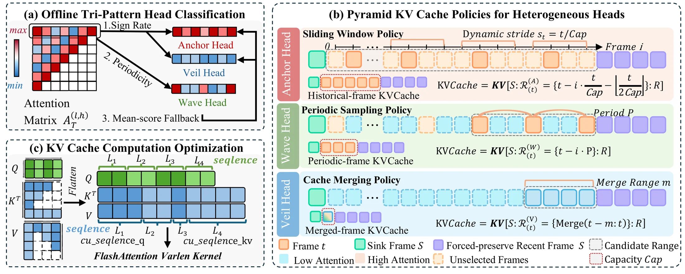

<p align="center">
<h1 align="center">Pyramid Forcing</h1>
<h3 align="center">Head-Aware Pyramid KV Cache Policy for High-Quality Long Video Generation</h3>
</p>

<p align="center">
  Jiayu Chen<sup>1</sup>
  &emsp;
  Junbei Tang<sup>2</sup>
  &emsp;
  Wenbiao Zhao<sup>3</sup>
  &emsp;
  &hellip;
  &emsp;
  <b>Xiang Chen<sup>1</sup></b>
</p>

<p align="center">
  <sup>1</sup>Peking University
  &emsp;
  <sup>2</sup>South China University of Technology
  &emsp;
  <sup>3</sup>Xinjiang University
</p>

<p align="center">
  <h3 align="center">
    <a href="https://if-lab-pku.github.io/Pyramid-Forcing/">Website</a>
    &nbsp;|&nbsp;
    <a href="https://github.com/if-lab-pku/Pyramid-Forcing">Code</a>
  </h3>
</p>

---

Pyramid Forcing is a training-free, head-aware pyramidal KV cache framework that enables long video generation in autoregressive video diffusion models. By classifying each attention head's temporal behavior and assigning a tailored `[sink + middle + recent]` cache composition per head, Pyramid Forcing extends Self Forcing / Causal Forcing on Wan2.1-T2V-1.3B to long-horizon generation **without any fine-tuning**.

<p align="center">
  
</p>

---

## Highlights
- **Offline Tri-Pattern Head Classification** sorts the 30 × 12 attention heads into **Anchor / Wave / Veil** groups using sign-rate statistics on pre-softmax logits plus frequency-domain periodicity (FFT), with a mean-score fallback for any remaining heads. Classification runs once per model on a small calibration set (32 prompts × 15 s) and is reused across all inference.

- **Pyramid KVCache Policies** assign three behavior-specific cache strategies over a shared `[sink + recent]` backbone — **Adaptive Strided Sliding Window** for Anchor Heads, **Periodic Sampling** for Wave Heads, and **Cache Merging** for Veil Heads — served by a **Ragged-Cache Attention** kernel (FlashInfer / FlashAttention varlen) that handles heterogeneous per-head cache lengths with dynamic RoPE remapped into the training position range. On 60-second Self Forcing, this lifts VBench-Long from 77.87 to 81.21 at comparable latency and peak GPU memory.

## Requirements
We tested this repo on the following setup:
* Nvidia GPU with at least 48 GB memory (evaluated on NVIDIA H200).
* Linux operating system.
* Python 3.10, CUDA 12.x, PyTorch 2.5.x, `flash-attn` 2.8.3.

Other hardware setups may also work but have not been tested.

## Installation
```
git clone https://github.com/if-lab-pku/Pyramid-Forcing.git
cd Pyramid-Forcing
uv sync
```

If `flash-attn` fails to build, install the prebuilt wheel matching Linux x86_64 + Python 3.10 + CUDA 12.x + torch 2.5 (`cxx11abi=False`):
```
uv pip install flash-attn --no-build-isolation \
    --find-links https://github.com/Dao-AILab/flash-attention/releases/download/v2.8.3/flash_attn-2.8.3+cu12torch2.5cxx11abiFALSE-cp310-cp310-linux_x86_64.whl
```
Numerical reproducibility of the paper assumes flash-attn 2.8.3 (not `2.8.3.postN`).

## Quick Start
### Download checkpoints
```
hf download Wan-AI/Wan2.1-T2V-1.3B --local-dir wan_models/Wan2.1-T2V-1.3B
hf download gdhe17/Self-Forcing checkpoints/self_forcing_dmd.pt --local-dir .
```

Note:
* **The model works better with long, detailed prompts** since the base Self Forcing checkpoint was trained with such prompts. Two prompt sets are shipped under [`prompts/`](prompts/) for a quick smoke test (`MovieGenVideoBench_num32.txt`) and a full VBench-style evaluation (`MovieGenVideoBench_num128.txt`).

* **Per-head classification labels** live under [`configs/head_configs/`](configs/head_configs/). The recommended `best_labels.csv` is a 30 × 12 matrix where `-1` = oscillating, `1` = stable (compact), `2` = stable-sparse.

## CLI Inference
### Pyramid Forcing Inference
Example inference script:
```
bash scripts/run_pyramid_forcing.sh \
    --config configs/pyramid-forcing.yaml \
    --output-dir videos/Exp_release_120f \
    --num-frames 120
```
```
CUDA_VISIBLE_DEVICES=0 uv run --no-sync python inference.py \
    --config_path configs/pyramid-forcing.yaml \
    --output_folder videos/quick_test \
    --checkpoint_path checkpoints/self_forcing_dmd.pt \
    --data_path prompts/MovieGenVideoBench_num32.txt \
    --use_ema
```
Note:
* `configs/pyramid-forcing.yaml` is the recommended head-aware preset used in the paper. Override `--num_output_frames` for longer clips; the cache auto-allocates based on this value.

### Self Forcing Baseline
Example inference script:
```
CUDA_VISIBLE_DEVICES=0 uv run --no-sync python inference.py \
    --config_path configs/self-forcing.yaml \
    --output_folder videos/Exp_baseline \
    --checkpoint_path checkpoints/self_forcing_dmd.pt \
    --data_path prompts/MovieGenVideoBench_num32.txt \
    --use_ema
```
Note:
* `configs/self-forcing.yaml` runs the unmodified Self Forcing / Causal Forcing baseline (no Pyramid Forcing); use this for ablations and apples-to-apples comparisons against the Pyramid Forcing configs.

## Acknowledgements
This codebase is built on top of the open-source implementations of [Self Forcing](https://github.com/guandeh17/Self-Forcing) by [Xun Huang](https://www.xunhuang.me/) and [Wan2.1](https://github.com/Wan-Video/Wan2.1) (Apache-2.0). The Self Forcing checkpoint is downloaded from HuggingFace (`gdhe17/Self-Forcing`) and is not redistributed here.

## Citation
If you find this codebase useful for your research, please kindly cite our paper:
```
BibTeX coming soon.
```
